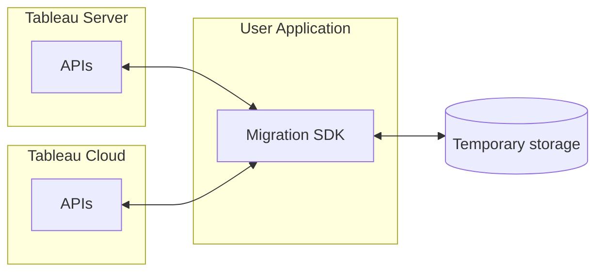

The Migration SDK is designed as a local application that primarily downloads content from Tableau Server to a local machine and then publishes it to Tableau Server. The Migration SDK exclusively uses the Tableau REST API to migrate content. (HTTP reference?)

